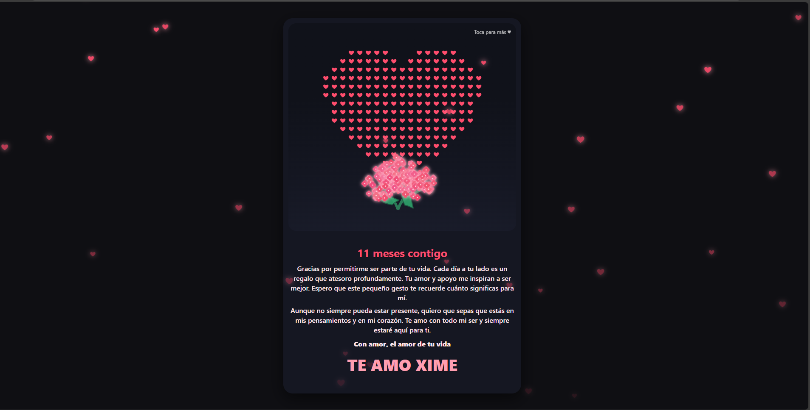
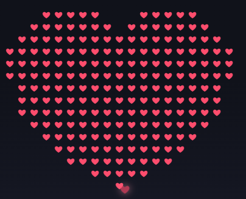
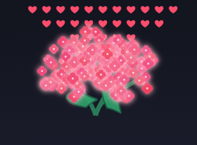
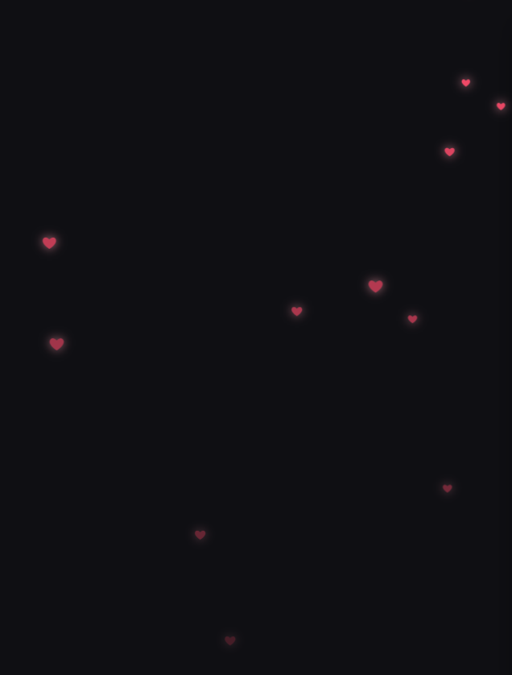

# 💖 Para Ti — Animación Interactiva

> Un detalle digital lleno de corazones, colores y flores, pensado para sorprender a alguien especial.

 <!-- Puedes reemplazar con una captura real -->

🌐 **Ver en Vivo** [ximeamor.space](https://ximeamor.space)

---

## ✨ Características

- 🌧 **Lluvia de corazones** constante en el fondo.
- 🖱 **Interacción al clic/tocar**: genera corazones extra que flotan y desaparecen.
- ❤️ **Corazón central animado** formado por una cuadrícula de puntos con efecto secuencial.
- 💐 **Ramo de flores SVG** que se dibuja línea por línea y florece progresivamente.
- ⚡ **Optimizaciones de rendimiento**:
  - Menor densidad y tamaño en pantallas móviles.
  - `animation-delay` en vez de cientos de `setTimeout`.
  - Dibujo por lotes del ramo con `requestAnimationFrame`.
  - Pool reutilizable para corazones generados por clic.
  - `will-change` en CSS para suavizar animaciones.

---

## 📂 Estructura del proyecto

```plaintext
index.html      # Página principal con HTML, CSS y JS integrados
```

> 💡 **No requiere dependencias externas**: Todo el código y estilos están en un único archivo HTML.

---

## 🚀 Uso

1. 📥 **Clonar o descargar** este repositorio.
2. 🌐 **Abrir** el archivo `index.html` en tu navegador o visitar el enlace en vivo.
3. 🎯 **Interactuar**:
   - Disfruta la lluvia de corazones.
   - Haz clic o toca para añadir más corazones.
   - Observa cómo se forma el corazón central y florece el ramo.

---

## 📱 Compatibilidad

- ✅ Navegadores modernos (Chrome, Edge, Firefox, Safari).
- 📱 Adaptado para pantallas móviles y escritorio.
- ♿ Respeta `prefers-reduced-motion` para usuarios que desactivan animaciones.

---

## 🛠 Personalización

Puedes cambiar fácilmente en el CSS:
- 🎨 Colores (`:root`).
- 📝 Texto de los mensajes.
- 🔢 Tamaño y cantidad de puntos del corazón.
- 🌺 Cantidad de pétalos del ramo.

---

## 🖼 Capturas de ejemplo

| Corazón central | Ramo floreciendo | Lluvia de corazones |
|-----------------|------------------|---------------------|
|  |  |  |

*(Reemplaza las imágenes con capturas reales de tu página)*

---

## 📄 Licencia

Este proyecto se distribuye con fines personales y educativos.  
Puedes modificarlo y adaptarlo para tus propios proyectos, pero se recomienda dar crédito al autor original.

---
💌 Hecho por Omar Bolaños con ❤️, CSS y JavaScript.
